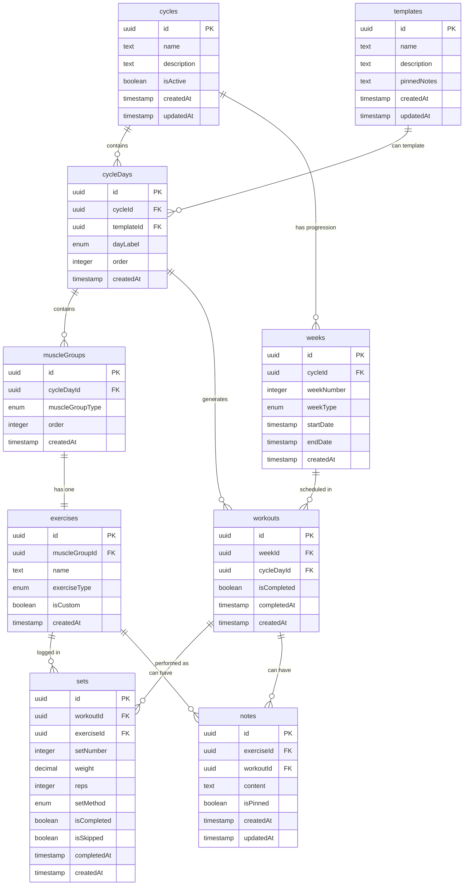

# Database Schema - Meathead App

## Key Relationships

- **Cycles** are the main training programs that contain days and weeks
- **Templates** can be used to structure cycle days  
- **Cycle Days** define the structure (what muscle groups on which days)
- **Muscle Groups** contain one exercise each
- **Weeks** represent progression/deload periods within cycles
- **Workouts** are the actual training sessions (intersection of week + day)
- **Sets** log the actual performance data (weight/reps)
- **Notes** can be attached to exercises (pinned) or specific workouts
