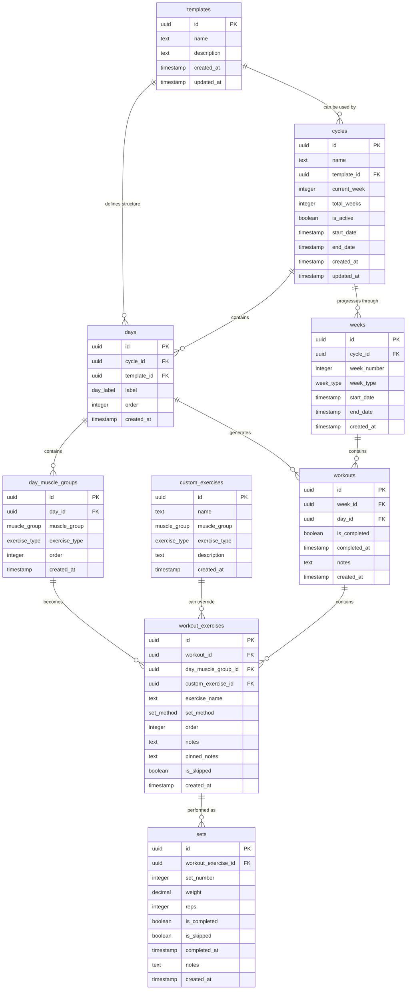

# Database Schema Diagram

## Schema Overview

### Planning Phase
1. **Templates** define reusable cycle structures
2. **Days** within templates contain **Day Muscle Groups**
3. Each muscle group specifies the target muscle and exercise type

### Cycle Creation
1. **Cycles** are created from templates or built from scratch
2. **Weeks** are generated for the cycle (7 progression + 1 deload)
3. **Workouts** are created for each day in each week

### Workout Execution
1. **Workout Exercises** are generated from day muscle groups
2. **Custom Exercises** can override default exercise selection
3. **Sets** track individual performance (weight, reps, completion)

### Key Relationships
- Templates → Cycles (reusable structures)
- Cycles → Weeks → Workouts (temporal progression)
- Days → Day Muscle Groups → Workout Exercises (structural hierarchy)
- Workout Exercises → Sets (performance tracking)

### Enums Used
- `day_label`: monday, tuesday, wednesday, thursday, friday, saturday, sunday
- `muscle_group`: chest, back, triceps, biceps, shoulders, quads, glutes, hamstrings, calves, traps, forearms, abs
- `exercise_type`: barbell, bodyweight_only, bodyweight_loadable, dumbbell, machine, smith_machine, cable, freemotion
- `set_method`: straight_sets, down_sets, giant_sets, supersets, myoreps, drop_sets
- `week_type`: progression, deload