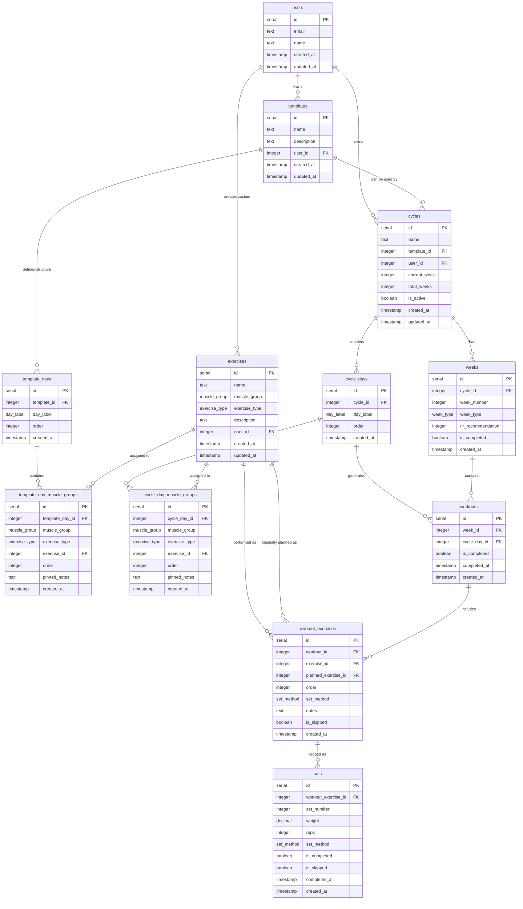

# Database Schema Relationships

## Data Flow

1. **User Registration**:
   - User account created in `users` table with email and name
   - All subsequent data is owned by and scoped to this user

2. **Template Creation Phase** (Optional):
   - User creates a `template` with name and description (owned by user)
   - Defines `template_days` with specific `day_label` ordering
   - Assigns `template_day_muscle_groups` with `muscle_group`, `exercise_type`, and optional `pinned_notes`
   - System assigns specific `exercises` (system or user's custom) to each muscle group

3. **Planning Phase**: 
   - User creates a `cycle` (optionally from a `template`, owned by user)
   - If using template: system copies `template_days` → `cycle_days` and `template_day_muscle_groups` → `cycle_day_muscle_groups`
   - If creating from scratch: defines `cycle_days` and `cycle_day_muscle_groups` directly

4. **Generation Phase**:
   - System creates `weeks` for the cycle (progression + deload)
   - Populates `rir_recommendation` for each progression week based on cycle length
   - Generates `workouts` for each day in each week
   - Creates `workout_exercises` based on cycle day muscle group assignments

5. **Tracking Phase**:
   - User performs workouts and logs `sets` with weight/reps
   - Can replace exercises (original stored in `planned_exercise_id`)
   - Can override set methods on individual sets
   - Can add notes, skip sets, or modify exercises
   - Marks workouts as completed when finished

## Key Design Decisions

- **User Ownership Model**: All user data (templates, cycles, custom exercises) is properly scoped to individual users with cascade deletion
- **System vs Custom Exercises**: `exercises.user_id` distinguishes between system-provided exercises (NULL) and user-created custom exercises (user ID)
- **Historical RIR Tracking**: `weeks.rir_recommendation` stores RIR values at generation time, preserving historical accuracy if progression rules change
- **Exercise Replacement Tracking**: `workout_exercises.planned_exercise_id` preserves the original planned exercise when users make substitutions
- **Flexible Set Method Control**: Default method on `workout_exercises` with optional per-set overrides on `sets` table
- **True Template Reusability**: Templates own their complete structural definition via `template_days` and `template_day_muscle_groups`, enabling proper reuse and sharing
- **Template-to-Cycle Copy Pattern**: When creating cycles from templates, the structure is copied (not referenced) to allow independent modification
- **Separation of Planning and Execution**: `cycle_day_muscle_groups` defines the plan, while `workout_exercises` handles the actual execution
- **Flexible Exercise Assignment**: Exercises can be assigned at template/planning time or dynamically during workouts
- **Template-Level Pinned Notes**: `template_day_muscle_groups.pinned_notes` allows templates to include persistent exercise guidance
- **Comprehensive Tracking**: Both set-level and exercise-level completion/skipping
- **Week Progression**: Clear distinction between progression and deload weeks