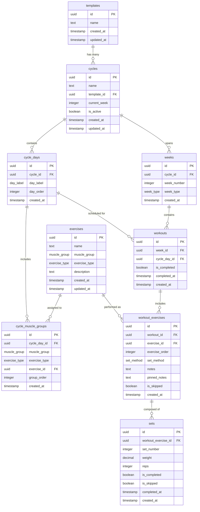

# Database Schema Diagram

This diagram shows the relationships between all tables in the fitness tracking application.

## Key Relationships

- **Templates** define reusable cycle structures
- **Cycles** are instances of templates with progression tracking
- **Cycle Days** define the weekly structure (Monday-Sunday)
- **Cycle Muscle Groups** specify which muscles are worked on each day
- **Weeks** track progression and deload periods within cycles
- **Workouts** are the actual training sessions for each day/week
- **Workout Exercises** are the specific exercises performed in each workout
- **Sets** record the individual sets (weight/reps) for each exercise
