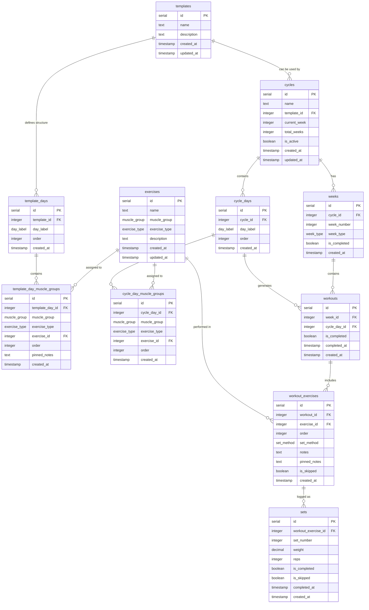

# Database Schema Relationships

## Data Flow

1. **Template Creation Phase** (Optional):
   - User creates a `template` with name and description
   - Defines `template_days` with specific `day_label` ordering
   - Assigns `template_day_muscle_groups` with `muscle_group`, `exercise_type`, and optional `pinned_notes`
   - System assigns specific `exercises` to each muscle group

2. **Planning Phase**: 
   - User creates a `cycle` (optionally from a `template`)
   - If using template: system copies `template_days` → `cycle_days` and `template_day_muscle_groups` → `cycle_day_muscle_groups`
   - If creating from scratch: defines `cycle_days` and `cycle_day_muscle_groups` directly

3. **Generation Phase**:
   - System creates `weeks` for the cycle (7 progression + 1 deload)
   - Generates `workouts` for each day in each week
   - Creates `workout_exercises` based on cycle day muscle group assignments

4. **Tracking Phase**:
   - User performs workouts and logs `sets` with weight/reps
   - Can add notes, skip sets, or modify exercises
   - Marks workouts as completed when finished

## Key Design Decisions

- **True Template Reusability**: Templates now own their complete structural definition via `template_days` and `template_day_muscle_groups`, enabling proper reuse and sharing
- **Template-to-Cycle Copy Pattern**: When creating cycles from templates, the structure is copied (not referenced) to allow independent modification
- **Separation of Planning and Execution**: `cycle_day_muscle_groups` defines the plan, while `workout_exercises` handles the actual execution
- **Flexible Exercise Assignment**: Exercises can be assigned at template/planning time or dynamically during workouts
- **Template-Level Pinned Notes**: `template_day_muscle_groups.pinned_notes` allows templates to include persistent exercise guidance
- **Comprehensive Tracking**: Both set-level and exercise-level completion/skipping
- **Week Progression**: Clear distinction between progression and deload weeks